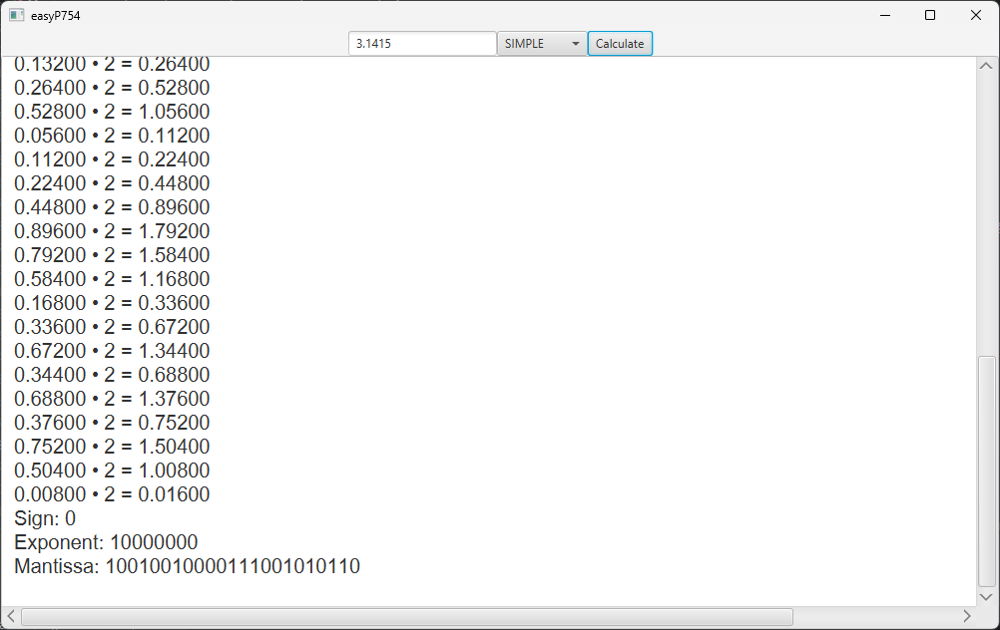

# easyP754




### What it is

A JavaFX app that shows the IEEE P754 representation of the number entered (in both single and double precision). All
calculations done are shown. 1000
decimals are used in almost every operation.

### Input examples

```text
3.1416
```

```text
-3.3254343
```

```text
23E10
```

```text
2^3
```

```text
2^-127
```

### Class diagram

The class diagram has helped us a lot to create an organized and readable software for humans.
[uml.txt](src/main/resources/uml.txt) has PlantUML code that generates the following class diagram.


1. ApplicationView asks user a text input.
2. UserInput generates a 100%-OK input for Calculator.
3. Calculator generates a UserOutput for a given UserInput, with all calculation data stored in Calculation.
4. ApplicationView shows UserOutput to the user.

We've applied **Model View Controller** design pattern, but in future we'll add more design patterns!

### Tech used

* [PlantUML](https://plantuml.com)
* IntelliJ IDEA
* Java
* JavaFX
* [big-math](https://github.com/eobermuhlner/big-math)

### Project acknowledgments

First I want to
thank [Dr. Manuel Joaquín Redondo González](https://produccioncientifica.uhu.es/investigadores/211190/detalle?lang=en)
for all hours we've been analyzing and improving this app.
I wait for these hours to pay off so that future _Computer Structure_ students will solve the exam problem easily.

I also want to thank **all future students** who will improve this app. Thanks to them easyP754 will keep improving, and
they deserve recognition in the project. I hope it will be a successful open-source project.

Last, I want to dedicate this app to [Borja López Pineda (BorjaLive)](https://github.com/BorjaLive). He had a huge
heart and helped lots of
partners by pure altruism, and he coded lots of similar projects to this one.
His closest friend [Diego Ortiz Más (SoyKhaler)](https://github.com/soykhaler) has given us permission to do so, and I
also thank him for being so
kind.

In summary, I dedicate this application to Borja wherever he is.

### Personal acknowledgments

Thanks to all my friends and family. Without their support this app couldn't exist.