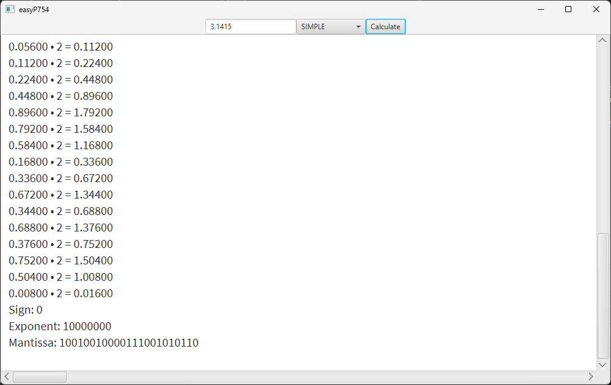
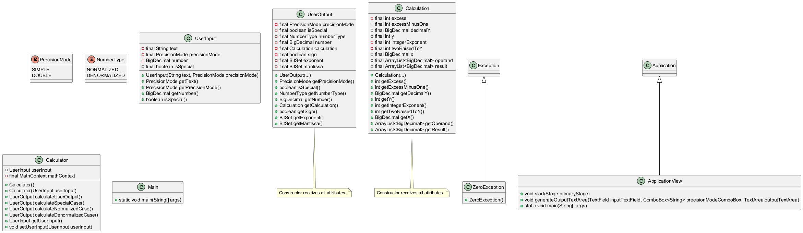

# easyP754

### What it is

A JavaFX app that shows the IEEE P754 representation of the number entered. All calculations done are shown.

### Class diagram

### Project acknowledgments

First I want to
thank [Dr. Manuel Joaquín Redondo González](https://produccioncientifica.uhu.es/investigadores/211190/detalle?lang=en)
for all hours we've been analyzing and improving this app.
I wait for these hours to pay off so that future _Computer Structure_ students will solve the exam problem easily.

I also want to thank **all future students** who will improve this app. Thanks to them easyP754 will keep improving, and
they deserve recognition in the project. I hope it will be a successful open-source project.

Last, I want to dedicate this app to [Borja López Pineda (BorjaLive)](https://github.com/BorjaLive). He had a huge
heart and helped lots of
partners by pure altruism, and he coded lots of similar projects to this one.
His closest friend [Diego Ortiz Más (SoyKhaler)](https://github.com/soykhaler) has given us permission to do so, and I
also thank him for being so
kind.

In summary, I dedicate this application to Borja wherever he is.

### Personal acknowledgments

Thanks to all my friends and family. Without their support this app couldn't exist.